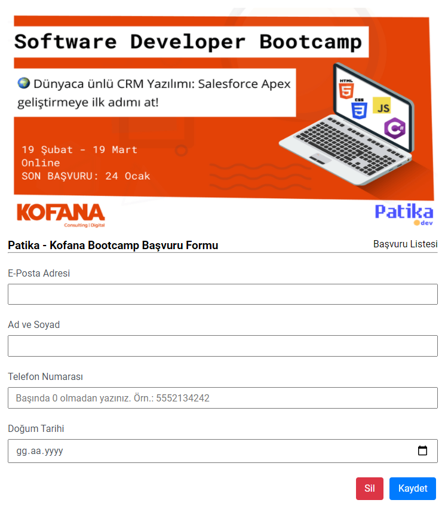

# Bootcamp Başvuru Formu / Bootcamp Application Form

## Hakkında / About

**[TR]** Javascript ile geliştirilmiş bootcamp başvuru formudur. Veriler Local Storage'a kaydedilmektedir.

**[EN]** This is a bootcamp application form which developed with javascript. Data is stored in local storage.

## Aşamalar / Stages

- [x] **[TR]** HTML yapısının hazırlanması / **[EN]** Preparing the HTML structure

- [x] **[TR]** Stillendirme işlemlerinin yapılması / **[EN]** Performing the style operations

- [x] **[TR]** Yeni başvuru formunun düzenlenmesi ve Local Storage'a kaydı / **[EN]** Editing of the new application form and registration on Local Storage

- [x] **[TR]** Kayıtların listelenmesi / **[EN]** Listing of records

- [x] **[TR]** Liste üzerinden düzenleme işlemlerinin yapılması / **[EN]** Performing editing operations on list

## Ekran Görüntüsü / Screenshots

